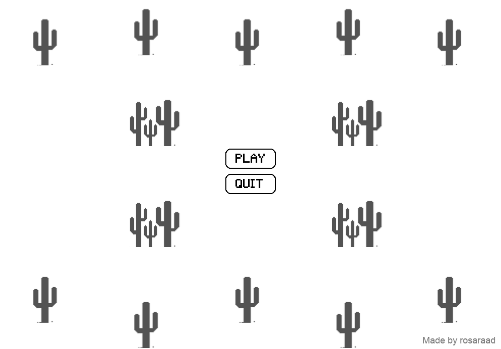
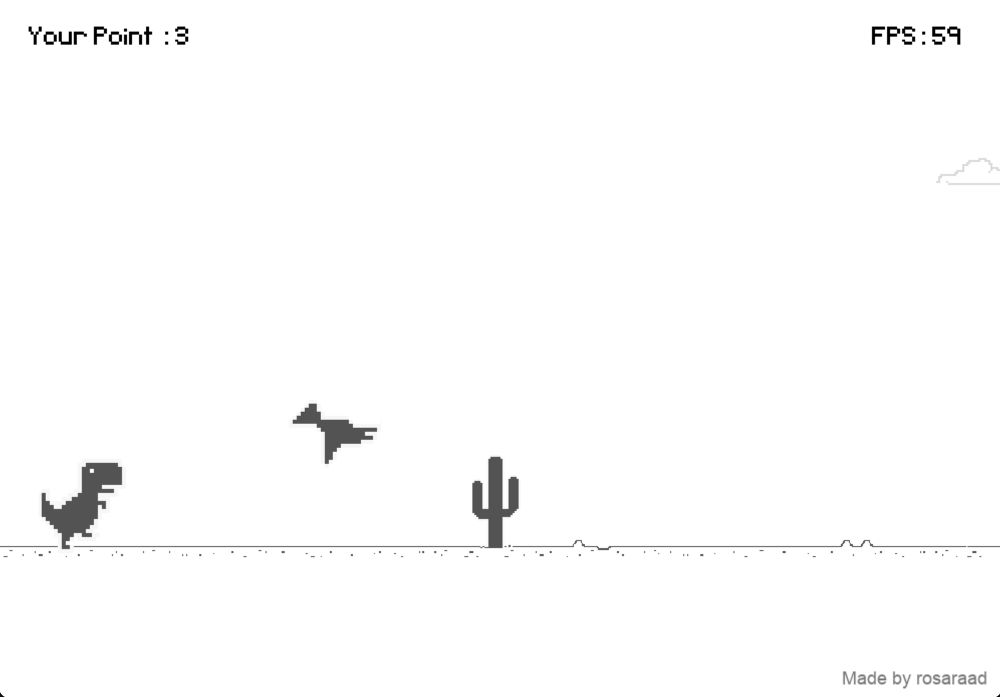
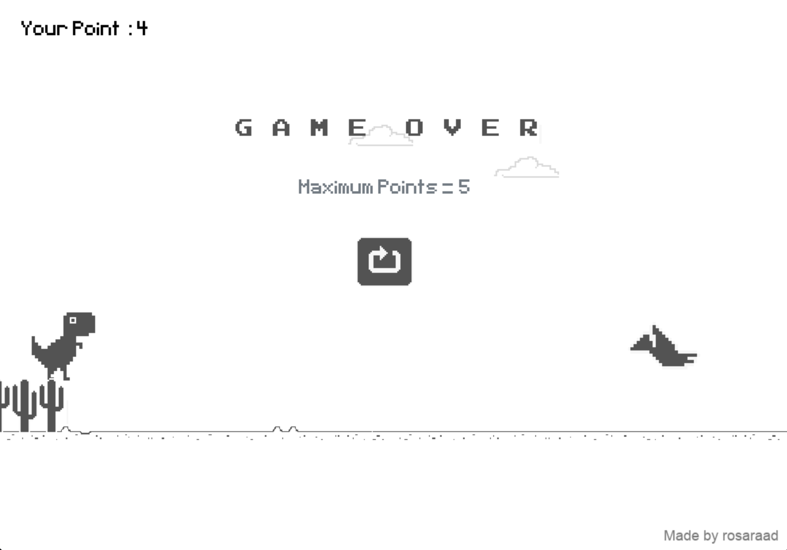
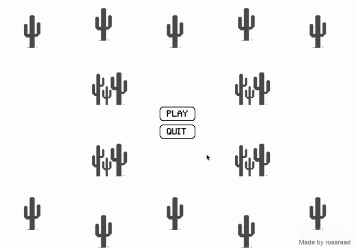

# 🦖 DinoGame 

A simple Dinosaur Game built from scratch using Python and Pygame.

## 📸 Preview

<table align="center">
  <tr>
    <th>Menu</th>
    <th>Gameplay</th>
    <th>Game Over</th>
  </tr>
  <tr>
    <td></td>
    <td></td>
    <td></td>
  </tr>
</table>
## 🎥 Demo

<p align="center">
  
</p>

## 🎮 Features

* Main menu with Play and Quit options
* Dino running, jumping, and ducking animations
* Jump sound effects and background music
* Moving ground
* Cactus obstacles
* Flying bird obstacle
* Collision detection
* Game Over screen
* Restart button
* Score system

## 🛠️ Built With

* Python
* Pygame

## 🚀 How to Run

1. Clone the repository:

```bash
git clone https://github.com/your-username/DinoGame.git
```

2. Install Pygame:

```bash
pip install pygame
```

3. Run the game:

```bash
python main.py
```

## 🎮 Controls

| Key          | Action |
| ------------ | ------ |
| `Space`      | Jump   |
| `↓` Key Down | Duck   |

## 📁 Project Structure

```text
DinoGame/
│
├── Assets/
│   ├── audio/
│   ├── Bird/
│   ├── Cactus/
│   ├── Dino/
│   ├── Font/
│   └── Other/
│
├── main.py
├── demo.gif
└── README.md
```
## 🛠️ Built With

-Python
-Pygame 

## 👩‍💻 Author

**Rosa Raad**

[GitHub](https://github.com/rosaraad)
